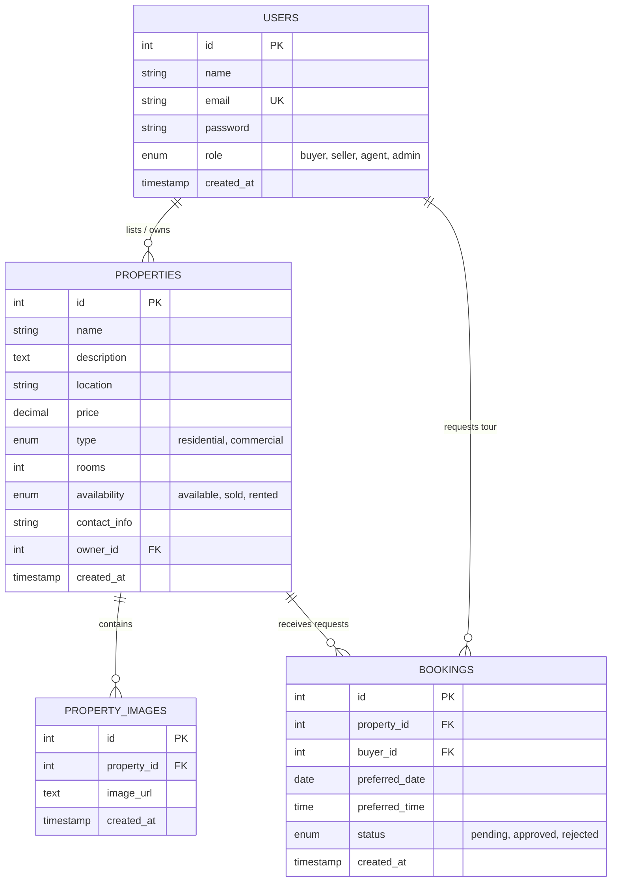

# Part 2: Relational MySQL Schema Design

In this section, we'll dive deep into our database layout, explore the relationships between our tables, and explain how the server automatically sets up everything for you.

---

## 1. Database Entity-Relationship (ER) Diagram

Our platform uses four primary tables linked by relational constraints:

---

## 2. Table Specifications and Fields

### A. The `users` Table
Stores account profiles. The `role` column uses an `ENUM` constraint to enforce that only verified role groups (`buyer`, `seller`, `agent`, `admin`) exist.
* **Security Rule**: The `password` field is sized `VARCHAR(255)` because bcrypt hashes produce 60-character strings, which require room to store safely.

### B. The `properties` Table
Houses all residential and commercial real estate profiles.
* **`owner_id` (Foreign Key)**: References `users(id)`. This links every listing back to its creator.
* **`ON DELETE CASCADE`**: If a Seller or Agent deletes their user account, all their properties are instantly purged, maintaining system hygiene.

### C. The `property_images` Table
Rather than storing a single image string inside the properties table, we created a separate `property_images` table.
* **One-to-Many Relation**: A single property can reference multiple image rows. This supports our sliding image gallery on the Property Details page.

### D. The `bookings` Table
Schedules tours. Acts as a join table linking a specific Buyer (`buyer_id`) to a listed Property (`property_id`) on a selected date and time.
* **`status` ENUM**: Defaults to `'pending'` until a host updates it.

---

## 3. The Mechanics of Automatic Seeding

To eliminate configuration friction, our Node server includes an automated bootloader in `backend/config/db.js` which does the following:

1. **Creates Database**: It runs `CREATE DATABASE IF NOT EXISTS real_estate_db;` immediately on start.
2. **Generates Schema**: Executes `CREATE TABLE IF NOT EXISTS` for all four tables in chronological order, respecting foreign key dependency sequences (e.g. `users` first, `properties` second, and `bookings` last).
3. **Validates Presence**: Queries `SELECT COUNT(*)` to check if records exist.
4. **Active Password Seeding**: If empty, the server employs bcrypt to hash separate starting passwords (`admin123`, `agent123`, etc.) and registers four standard user accounts.
5. **Seeding Properties**: It then registers three detailed properties, joins them with their designated host IDs, and populates the `property_images` gallery with beautiful Unsplash pictures.

This guarantees that as soon as you start the application, you have a fully populated database ready to demo!
